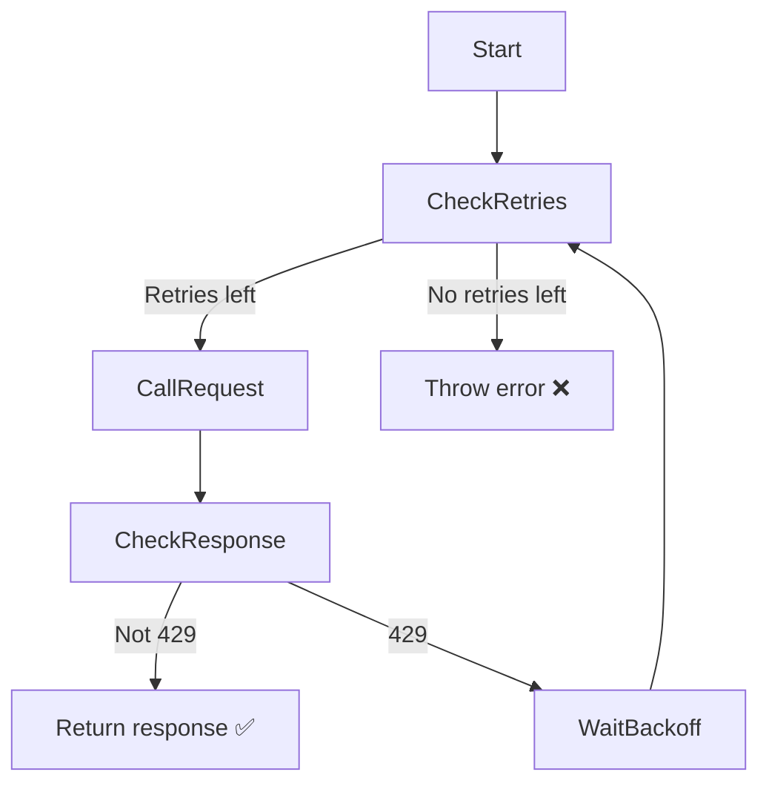
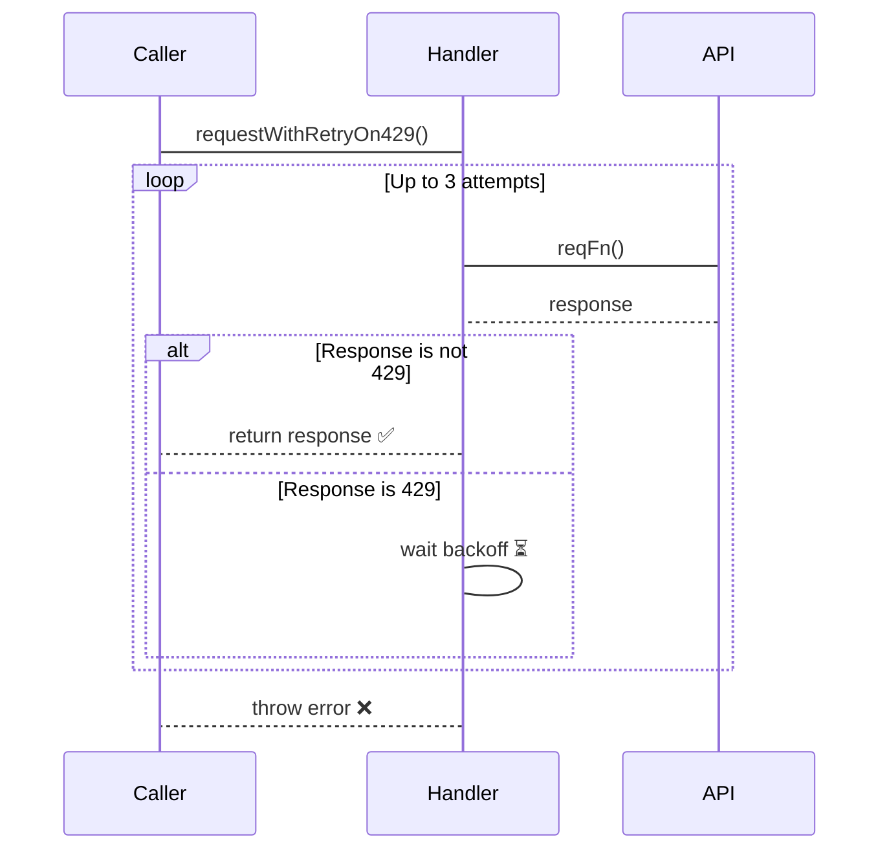

### What happend? 🤨

I stumbled upon a storm of **429 errors** while running **Playwright** tests in **CI**.

The reason? 
: The **CI worker** had a **much faster connection** than my local machine behind a **VPN** when writing and debugging tests. 

### How to handle such inconvenience 👀

#### [Solution 1] Add `waits` in `test.afterEach` — _Done 💅_ 

{: width="50" height="50"}
_**Good Job!** (fired)_

EXAMPLE
: You have `100` tests and add a `500ms` wait in `afterEach`:  
`100 × 500ms / 1000 = 50 seconds` is wasted into oblivion.  
- And this **sacrifice of time** will only **grow exponentially** as your test suite scales.


#### [Solution 2] Use unique API keys or users to avoid hitting the limit

This one is **a bit better** - but do you really want to **bother**? 🙂
- **AND** what if it's just **one endpoint** you're testing?

#### [Solution 3] Change system rate limit when `CI` flag is passed

**Technically possible**, but again — **much hassle**. 
<br>Besides your **test** become **flaky**
-  ❗️ `YOU` need to **remember** about this
-  ⚠️ `YOU` **change** systems **original state** - **not good** either 
-  🚫 `YOU` are fixing **symptom**, not the **cause**

### One retry to rule them all 💍

To fix it cleanly, I added a **reusable retry handler** for `429 Too Many Requests`.

```typescript
import type { APIResponse } from "@playwright/test";

export async function requestWithRetryOn429(
  reqFn: () => Promise<APIResponse>,
  retries: number = 3,
  backoff: number = 500,
): Promise<APIResponse> {
  const delay = (ms: number) => new Promise((resolve) => setTimeout(resolve, ms));

  for (let i = 0; i < retries; i++) {
    const response = await reqFn();
    if (response.status() !== 429) return response;
    await delay(backoff * (i + 1));
  }

  throw new Error("Too many retries due to 429 errors");
}
```

#### Flowchart for younger generations 

#### Sequence for the OG 



#### Simple exaple of use
```typescript
...

async function getBalance() {
  return context.get("https://api.ibank.com/my-balance");
}

const response = await requestWithRetryOn429(makeApiCall, 5, 500);

...
```
#### Outcome
{: width="250" height="250" .right}
- Tests no longer fail when a `429 Too Many Requests` response is received  
- Wait (backoff) is triggered **only** when a `429` occurs  
- The request is **automatically retried** after the specified delay  
- CI runs have become significantly **more stable**  
- This is a **reusable** solution that addresses the `root cause`

Check out code repo here:
: [**Playwright example project**](https://github.com/petergaevoy/playwright/tree/main)
